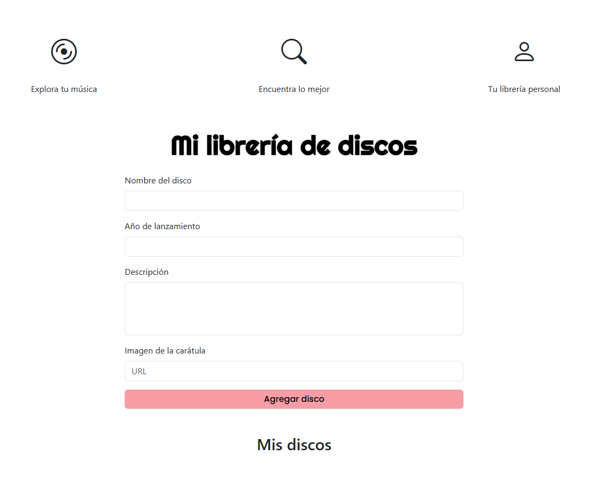

# 🎶 App de Discos

Este proyecto forma parte del **Ejercicio 3** del curso de Introducción a la Programación.  
Consiste en una aplicación web interactiva que muestra una colección de discos usando el DOM.

---

## 🌐 Tecnologías utilizadas

- ✅ HTML5
- 🎨 CSS3
- ⚙️ JavaScript (vanilla)
- 🧠 Manipulación del DOM

---

## 📸 Vista previa




---

## 🚀 ¿Cómo usar la app?

1. Clona este repositorio:
   ```bash
   git clone https://github.com/Lorena-Rodriguez/app_discos.git

2. Abre el archivo index.html en tu navegador.

3. ¡Listo! Ya puedes interactuar con la app.

## ✨ Funcionalidades

- Mostrar una lista de discos.
- Ver detalles dinámicamente al hacer clic.
- Estilos visuales con CSS.


📁 Estructura de archivos
pgsql
Copiar
Editar
📦 app-discos
├── index.html
├── style.css
└── script.js
🙋‍♀️ Autora
Lorena Rodríguez
GitHub: @Lorena-Rodriguez

💡 Nota
Este proyecto fue creado con fines educativos como parte de mi formación en programación web impartida por Accenture. ¡Gracias por pasarte por aquí!

